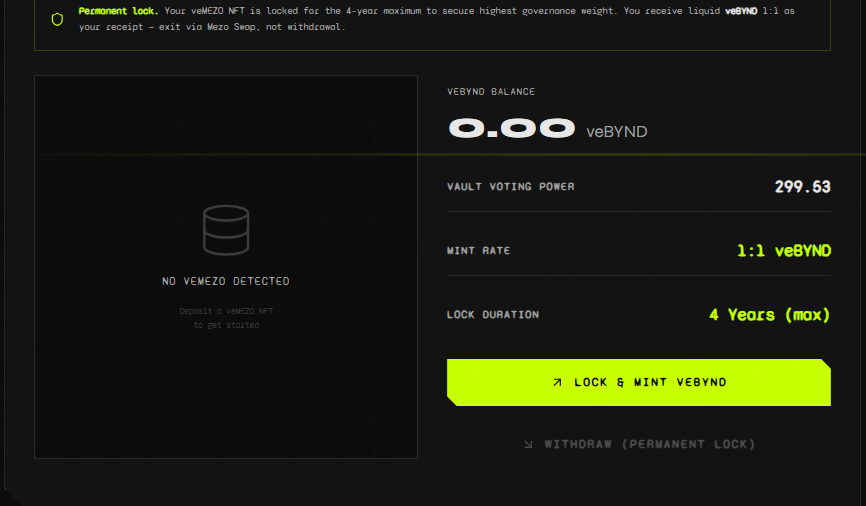
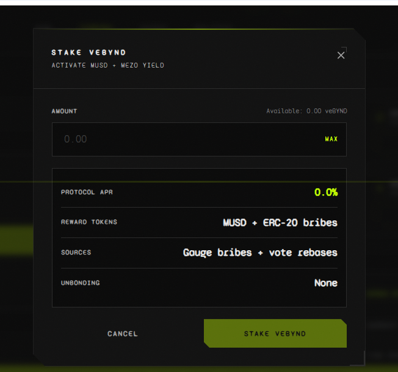
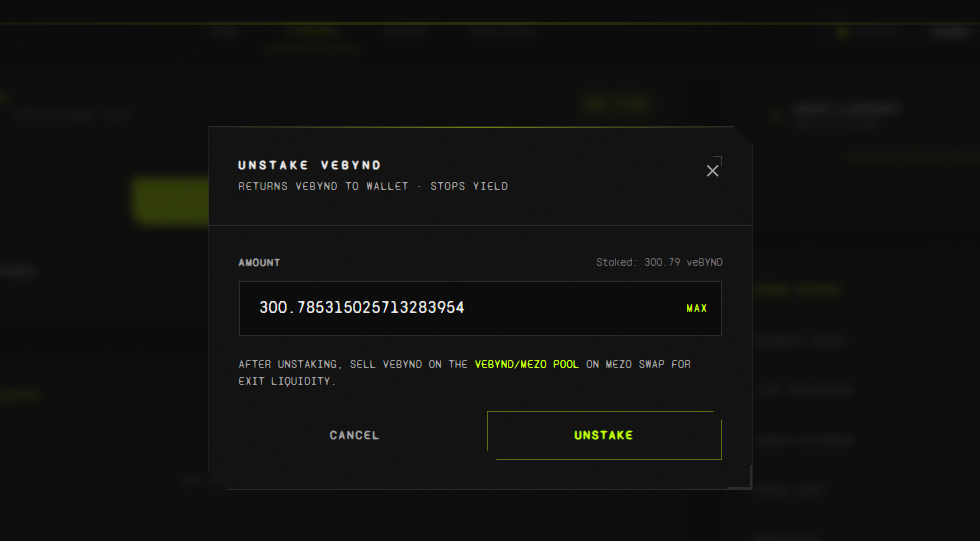

# BynD Protocol

**The Boost Coordination Layer for veMEZO**

*Aggregate. Optimise. Earn. At scale.*

> Mezo Hackathon 2026 — Samuel Egin · Gabriel Michael Ojomakpene

---

## Overview

BynD is a non-custodial boost coordination layer that aggregates veMEZO boost liquidity, automates gauge allocation toward the highest-yielding veBTC gauges, and issues **veBYND** — a liquid ERC-20 token representing a transferable claim on the pooled position.

Users deposit veMEZO NFTs into BynD once. The protocol maintains those positions at maximum lock, continuously routes aggregated boost power to the highest-ROI gauges, and compounds veMEZO rebases back into each position automatically. In return, users receive veBYND — freely tradeable or stakeable to earn protocol yield in any ERC-20 token harvested from gauge bribe incentives.

**BynD converts illiquid, inactive veMEZO positions into a liquid, yield-bearing asset.**

> **How veMEZO works on Mezo:** veMEZO is a boost coordination layer — not direct governance. veMEZO holders vote on boost gauges, which amplify veBTC positions by up to 5x. veBTC is the core governance/voting asset. BynD aggregates fragmented veMEZO boost power into a single optimised block, routing it toward the gauges with the highest bribe incentives.

---

## Repository Structure

The repo is a **pnpm workspace monorepo** orchestrated with **Turborepo**:

```
BYND/
├── apps/
│   └── web/                Vite + React frontend (@bynd/web) with Mezo Passport wallet integration
├── packages/
│   └── contracts/          Solidity contracts + Hardhat (@bynd/contracts) — deploy scripts, tests, mocks
├── package.json            Root workspace (private) — turbo task entry points
├── pnpm-workspace.yaml     packages: ["apps/*", "packages/*"]
└── turbo.json              Build pipeline & task dependencies
```

All dependencies are installed once from the repo root with `pnpm install` — pnpm hoists every package into a single content-addressed store under the root `node_modules/.pnpm`, and each workspace only receives symlinks to its declared dependencies. Common tasks run from the root via Turborepo (`pnpm build`, `pnpm test`, `pnpm dev`), or against a single workspace with `pnpm --filter @bynd/web <script>` / `pnpm --filter @bynd/contracts <script>`.

The frontend targets Mezo Matsnet (Chain ID `31611`) and integrates with the real veMEZO, MUSD, RewardsDistributor, and ValidatorsVoter contracts live on Matsnet, with Mezo Passport for native wallet support across MetaMask, OKX, Unisat, and Xverse. The contracts package also ships mocks (`MockVeMEZO`, `MockERC20`, `MockValidatorsVoter`) and a `deploy:local` script for iterating against a local Hardhat node.

---

## The Problem

veMEZO holders can direct boost power on Mezo, but participation is structurally low:

- **Manual vote management** — holders must vote every 7 days or lose all incentives
- **No liquidity** — veMEZO is a non-transferable NFT with no exit before expiry
- **Fragmented boost power** — individual holders are too small to move gauge outcomes
- **Missed rebases** — Mezo pays a rebase to veMEZO holders each epoch; most go unclaimed
- **Low participation** — boost is misallocated, yield is missed every epoch

---

## The Solution

BynD aggregates veMEZO positions into a single coordinated boost block and automates all epoch actions.

### User Flow

```
01  Deposit veMEZO NFT into ByNdVault
02  Receive veBYND (ERC-20) 1:1 ratio
03  Stake veBYND to earn rewards (any ERC-20 bribe token)
04  Exit by selling veBYND on secondary market
```

---

## Screenshots

### Lock veMEZO & Mint veBYND
Deposit a veMEZO NFT to receive veBYND 1:1. The vault permanently locks to 4-year maximum for highest governance weight.



### Stake veBYND
Stake veBYND to activate your share of MUSD + ERC-20 bribe yield. No unbonding period.



### Unstake veBYND
Unstake anytime. Exit liquidity via the veBYND/MEZO pool on Mezo Swap.



---

## Architecture

| Contract | Role |
|---|---|
| `ByNdVault` | Custodies veMEZO NFTs · mints veBYND 1:1 · maintains max 4yr lock · runs claimRebases() |
| `VeBYND` | Liquid ERC-20 receipt token representing a claim on pooled veMEZO boost liquidity |
| `ByNdStaking` | Multi-token reward distributor (Synthetix pattern, N simultaneous tokens) · claimAll() |
| `ByNdVoter` | Epoch executor · routes boost to high-yield gauges · sweeps any ERC-20 bribe · pays 1% keeper bounty |

---

## Reward Model

### Stream 1 — veMEZO Rebase (auto-compounds into boost power)

Mezo's RewardsDistributor pays a rebase to veMEZO holders each epoch. BynD calls `claimRebases()` which triggers `distributor.claimMany(allTokenIds)`. The distributor calls `ve.depositFor(tokenId, amount)` for each NFT, compounding the rebase directly back into BynD's locked MEZO balance.

**No liquid tokens leave the vault.** Stakers benefit indirectly: more locked MEZO → larger aggregated boost block → larger share of gauge bribe incentives each epoch.

### Stream 2 — Gauge Bribe Incentives (any ERC-20)

`harvestAndDistribute()` sweeps every ERC-20 bribe token from all voted gauges. 99% goes to veBYND stakers via `ByNdStaking.notifyRewardAmount(token, amount)`. 1% goes to the keeper as a bounty, paid in every token harvested.

```
stakerShare(i, token) = (stakedBalance(i) / totalStaked) × (totalHarvested(token) × 0.99)
```

---

## Epoch Execution — 4 Permissionless Steps

```
Step 00  claimRebases()           Compounds veMEZO rebase into each NFT's locked balance
                                   No epoch gate — call any time, permissionless

Step 01  extendLocks()            Resets all veMEZO to maximum 4-year lock
                                   Once per 7-day epoch

Step 02  castVotes()              Routes aggregated boost power to highest-ROI gauges
                                   Opens ~4hrs before epoch end (Thu ~20:00 UTC)

Step 03  harvestAndDistribute()   Sweeps all ERC-20 bribe tokens from all gauges
                                   1% bounty to caller in every harvested token
                                   99% distributed to veBYND stakers
```

Any wallet can call any step. First caller of `harvestAndDistribute()` earns the bounty.

---

## Live Deployment — Mezo Matsnet (chainId 31611)

| Contract | Address |
|---|---|
| veMEZO (native) | `0xaCE816CA2bcc9b12C59799dcC5A959Fb9b98111b` |
| MUSD (native) | `0x118917a40FAF1CD7a13dB0Ef56C86De7973Ac503` |
| RewardsDistributor (native) | `0x2962E8817ae716019F759d098e2caE658bDcAd04` |
| ValidatorsVoter (native) | `0x21d7bDF5a5929AD179F8cA0c9014A0B62ae6Bfd1` |
| **VeBYND** | `0x28581E2dc44ba67f78CAD75592Db868eb0EEB45E` |
| **ByNdVault** | `0x4F37E23bb768D9f4bF041384AF69Fdc6A9591130` |
| **ByNdStaking** | `0x934EA7318fd8cF660282000D6C16fa631Ba5ECeE` |
| **ByNdVoter** | `0x6925E1BAEeA6B0D9E14e7D9cdeaEf10614b628ef` |

---

## Running Locally

### Prerequisites
- Node.js v18+
- pnpm v10+ (`corepack enable` or `npm i -g pnpm`)
- Two terminal windows

### Install once (repo root)
```bash
pnpm install
```

### Terminal 1 — Start Hardhat node
```bash
pnpm --filter @bynd/contracts node
```

### Terminal 2 — Deploy and start frontend
```bash
pnpm --filter @bynd/contracts deploy:local
pnpm --filter @bynd/web sync-addresses
pnpm --filter @bynd/web dev
```

### MetaMask Setup
Add Hardhat Local: RPC `http://127.0.0.1:8545` · Chain ID `31337` · Symbol `ETH`

Import test key (Hardhat Account #0 — never use for real funds):
```
0xac0974bec39a17e36ba4a6b4d238ff944bacb478cbed5efcae784d7bf4f2ff80
```

The **Skip Epoch** button (visible on Chain ID 31337 only) fast-forwards the EVM clock so you can demo the full epoch flow without waiting 7 days.

---

## Running on Matsnet

### Prerequisites
- Node.js v18+ and pnpm v10+
- Funded Matsnet wallet (BTC for gas)
- `DEPLOYER_PRIVATE_KEY` in `packages/contracts/.env`

### Redeploy (optional — contracts are already live above)
```bash
pnpm install
pnpm --filter @bynd/contracts deploy:matsnet
```

The deploy script automatically:
- Deploys all 4 contracts
- Wires MINTER_ROLE, distributor, and RewardsDistributor
- Scans ValidatorsVoter for alive gauges (capped at 20 for gas safety)
- Saves addresses to `deployed-addresses.json`

### Update frontend addresses (after redeploy only)
Edit `apps/web/.env` with the new addresses from deploy output.

### Start frontend
```bash
pnpm --filter @bynd/web dev
```

### Keeper operations (each epoch)
```bash
# Step 00 — any time
cast send <ByNdVault> "claimRebases()" --private-key <KEY> --rpc-url <RPC>

# Step 01 — once per epoch
cast send <ByNdVault> "extendLocks()" --private-key <KEY> --rpc-url <RPC>

# Step 02 — opens ~4hrs before epoch end
cast send <ByNdVoter> "castVotes()" --private-key <KEY> --rpc-url <RPC>

# Step 03 — after votes cast (earns 1% bounty)
cast send <ByNdVoter> "harvestAndDistribute()" --private-key <KEY> --rpc-url <RPC>
```

---

## Gauge Optimiser

Before each epoch vote, run the optimiser to allocate boost weight to the highest-ROI gauges:

```bash
cd packages/contracts
pnpm hardhat run scripts/optimiseGauges.ts --network matsnet
```

The optimiser scans all alive gauges from ValidatorsVoter, ranks by `ROI = claimable / totalWeight` (uncontested gauges have ROI = infinity), selects the top N, and calls `voter.setGauges()` with proportional weights.

---

## Tech Stack

| Layer | Stack |
|---|---|
| Monorepo | pnpm workspaces · Turborepo |
| Smart Contracts | Solidity 0.8 · Hardhat · ethers v6 |
| Frontend | React · Vite · wagmi v2 · viem |
| Wallet | Mezo Passport · MetaMask · OKX · Unisat · Xverse |
| Styling | Tailwind CSS |
| Keeper Scripts | TypeScript · optimiseGauges.ts · cast (Foundry) |

---

## Team

**Samuel Egin** — Blockchain Dev · [@0xEtherfren](https://x.com/0xEtherfren)

**Gabriel Michael Ojomakpene** — Frontend Dev · [LinkedIn](https://www.linkedin.com/in/codewitgabi)

*Mezo Hackathon 2026*
