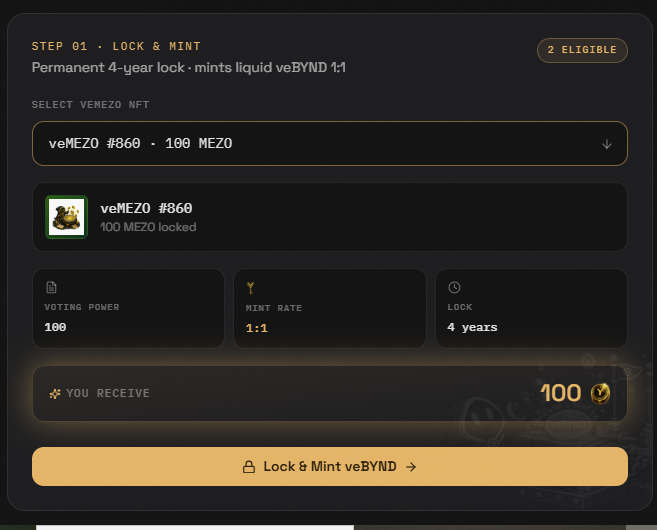
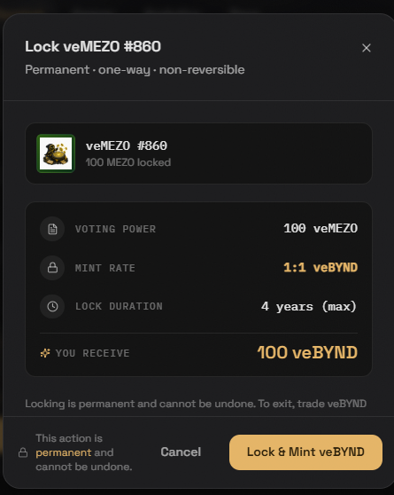
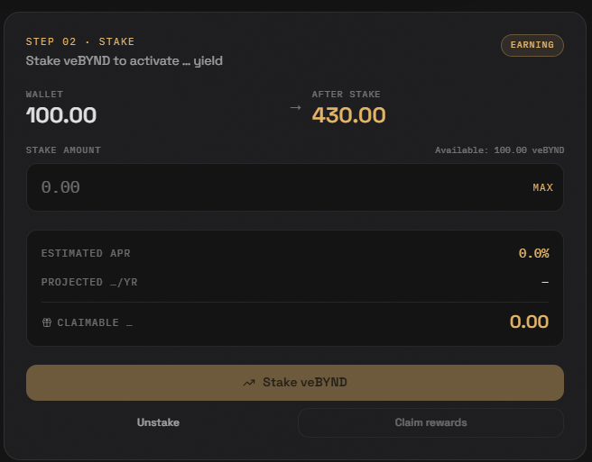
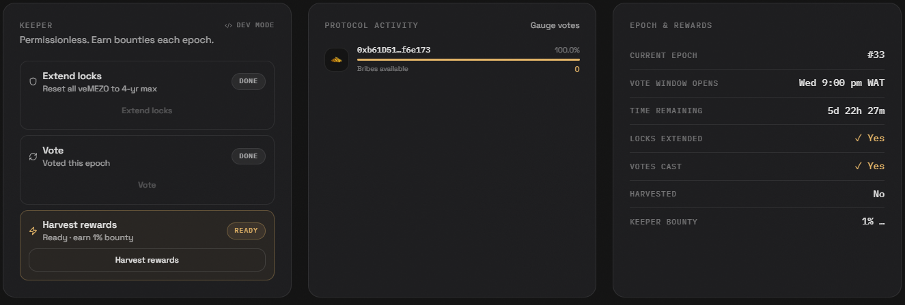
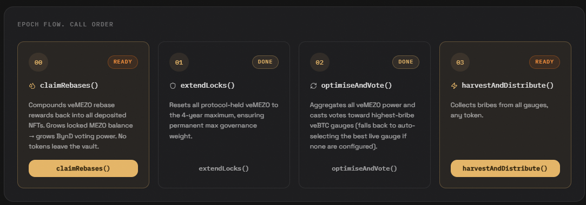
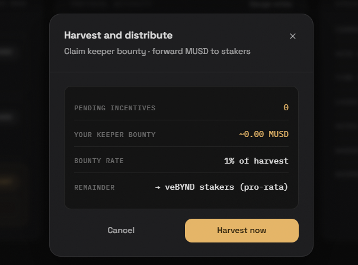
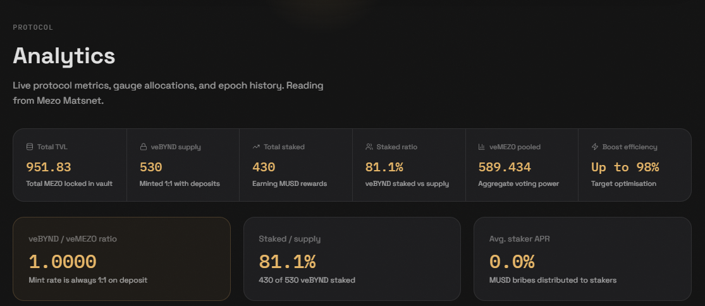

# BynD Protocol

**The Boost Coordination Layer for veMEZO**

*Aggregate. Optimise. Earn. At scale.*

> Mezo Hackathon 2026 — 2nd Place, MEZO Utilization track — Samuel Egin · Gabriel Michael Ojomakpene

---

## Overview

BynD is a non-custodial boost coordination layer that aggregates veMEZO boost liquidity, automates gauge allocation toward the highest-yielding veBTC gauges, and issues **veBYND** — a liquid ERC-20 token representing a transferable claim on the pooled position.

Users deposit veMEZO NFTs into BynD once. The protocol maintains those positions at maximum lock, continuously routes aggregated boost power to the highest-ROI gauges, and compounds veMEZO rebases back into each position automatically. In return, users receive veBYND — freely tradeable or stakeable to earn protocol yield in any ERC-20 token harvested from gauge bribe incentives.

**BynD converts illiquid, inactive veMEZO positions into a liquid, yield-bearing asset.**

> **How veMEZO works on Mezo:** veMEZO is a boost coordination layer not direct governance. veMEZO holders vote on boost gauges, which amplify veBTC positions by up to 5x. veBTC is the core governance/voting asset. Bynd aggregates fragmented veMEZO boost power into a single optimised block, routing it toward the gauges with the highest bribe incentives.

---

## Repository Structure

The repo is a **pnpm workspace monorepo** orchestrated with **Turborepo**:

```
BYND/
├── apps/
│   └── web/                Vite + React frontend (@bynd/web) with Mezo Passport wallet integration
├── packages/
│   └── contracts/          Solidity contracts + Hardhat (bynd-v2-contracts) — deploy scripts, tests, mocks
├── package.json            Root workspace (private) — turbo task entry points
├── pnpm-workspace.yaml     packages: ["apps/*", "packages/*"]
└── turbo.json              Build pipeline & task dependencies
```

All dependencies are installed once from the repo root with `pnpm install` — pnpm hoists every package into a single content-addressed store under the root `node_modules/.pnpm`, and each workspace only receives symlinks to its declared dependencies. Common tasks run from the root via Turborepo (`pnpm build`, `pnpm test`, `pnpm compile`), or against a single workspace with `pnpm --filter @bynd/web <script>` / `pnpm --filter bynd-v2-contracts <script>`.

The frontend targets Mezo Matsnet (Chain ID `31611`) and integrates with the real veMEZO, MUSD, RewardsDistributor, and BoostVoter contracts live on Matsnet, with Mezo Passport for native wallet support across MetaMask, OKX, Unisat, and Xverse. The contracts package also ships mocks (`MockVeMEZO`, `MockERC20`, `MockBoostVoter`, `MockRewardsDistributor`) for a Matsnet dry-run against `chainId 31337`.

---

## The Problem

veMEZO holders can direct boost power on Mezo, but participation is structurally low:

- **Manual vote management** — holders must vote every epoch or lose all incentives
- **No liquidity** — veMEZO is a non-transferable NFT with no exit before expiry
- **Fragmented boost power** — individual holders are too small to move gauge outcomes
- **Missed rebases** — Mezo pays a rebase to veMEZO holders each epoch; most go unclaimed
- **Low participation** — boost is misallocated, yield is missed every epoch

---

## The Solution

BynD aggregates veMEZO positions into a single coordinated boost block and automates all epoch actions via permissionless, gas-bounded keeper calls.

### User Flow

```
01  Deposit veMEZO NFT into ByNdVault
02  Receive veBYND (ERC-20) 1:1 with the NFT's locked MEZO amount
03  Stake veBYND to earn rewards (any ERC-20 bribe token)
04  Claim rewards anytime, or exit by selling veBYND on the secondary market
```

---

## Screenshots

### Lock veMEZO & Mint veBYND
Deposit a veMEZO NFT to receive veBYND 1:1. The vault keeps deposited locks extended toward the 4-year maximum for highest governance weight, and every deposit after the first is merged into a single canonical veMEZO NFT so the vault's gas cost never scales with how many people deposit.

Merging is **confirmed working on Matsnet**. Deposits of tokenIds `864` and `869` both emitted `MergedIntoCanonical(tokenId, 860)`: each NFT was burned by veMEZO's `merge()`, its locked MEZO folded into canonical tokenId `860`, and `veBYND` still minted 1:1 to the depositor. `getAllTokenIds()` did not grow, so the pool's per-epoch work is unchanged by those deposits — which is the entire point of consolidation.

```
block 14693953  Deposited  tokenId=864 minted=100.0
block 14693953  MergedIntoCanonical  tokenId=864 -> canonical=860
block 14694004  Deposited  tokenId=869 minted=100.0
block 14694004  MergedIntoCanonical  tokenId=869 -> canonical=860
```

> **Reading the vault's history:** tokenIds `857`, `829`, `859`, `866` and `860` are each tracked separately in `getAllTokenIds()` because they were deposited **before** the canonical-merge logic shipped, when the vault had no `canonicalTokenId` to merge into. `860` became canonical simply by being the first deposit after that upgrade, while `canonicalTokenId` was still `0`. Those five pre-existing positions are not retro-merged; they stay as managed stragglers and every new deposit merges into `860`. Absence of a `MergeFailedFallback` event for them is the tell — they never attempted a merge at all.




### Stake & Unstake veBYND
Stake veBYND to activate your share of  ERC-20 bribe yield, unstake anytime with no unbonding period, and claim accrued rewards.



### Keeper Dashboard
Every epoch step is permissionless and callable by anyone — extend locks, cast the epoch vote, and harvest rewards for a keeper bounty. Each step shows whether it's open right now, already claimed by another keeper this epoch, or counting down to its window. The dashboard also surfaces live gauge votes and the current epoch's timing.



### Epoch Flow
The 5-step, gas-bounded epoch machine: `claimRebases()` → `extendLocks()` → `optimiseAndVote()` → `claimBribesBatch()` → `harvestAndDistribute()`. Two of the five are time-gated to the run-up to Mezo's Thursday 00:00 UTC epoch boundary — `extendLocks()` opens in the final 24h and `optimiseAndVote()` in the final 3h — and each gated step is creditable to only one keeper per epoch. The dashboard counts down to each window so nobody wastes gas racing a call that would revert.



### Harvest & Distribute
Claims the epoch's keeper bounty and forwards the remainder of harvested bribes to veBYND stakers, pro-rata.



### Analytics
Live protocol metrics read directly from Mezo Matsnet — TVL, veBYND supply, staking ratio, pooled veMEZO, and gauge vote allocation.



---

## Architecture

| Contract | Role |
|---|---|
| `ByNdVault` | Custodies veMEZO NFTs (UUPS upgradeable) · mints veBYND 1:1 · every deposit after the first is merged into a single canonical veMEZO NFT via `merge()`, so `extendLocks()`/`claimRebases()` take no arguments and gas never scales with vault size · a deposit whose `merge()` reverts is kept as a separately-managed straggler rather than failing the deposit |
| `VeBYND` | Liquid ERC-20 receipt token, `AccessControl`-gated `mint`/`burn` (`MINTER_ROLE`/`BURNER_ROLE`), UUPS upgradeable via `UPGRADER_ROLE` |
| `ByNdStaking` | Multi-token reward distributor (Synthetix `rewardPerToken` pattern, unlimited simultaneous reward tokens) · `claimAll()` / `claimReward(token)` |
| `ByNdVoter` | Epoch state machine · on-chain gauge optimiser or governance-set gauge list · batched bribe claiming · 5-way keeper bounty split · optional protocol fee · emergency epoch escape hatch |

---

## Reward Model

### Stream 1 — veMEZO Rebase (auto-compounds into boost power)

Mezo's RewardsDistributor pays a rebase to veMEZO holders each epoch. A keeper calls `ByNdVault.claimRebases()` — no arguments needed — which triggers `distributor.claimMany(tokenIds)` against whatever the vault currently manages (almost always just the single canonical veMEZO NFT every deposit gets merged into). The distributor calls `ve.depositFor(tokenId, amount)`, compounding the rebase directly back into BynD's locked MEZO balance.

**No liquid tokens leave the vault.** Stakers benefit indirectly: more locked MEZO → larger aggregated boost block → larger share of gauge bribe incentives each epoch.

### Stream 2 — Gauge Bribe Incentives (any ERC-20)

`harvestAndDistribute()` finalizes the epoch's bribe sweep once every managed tokenId has had its bribes claimed via `claimBribesBatch()`. For each harvested token that clears its minimum-harvest threshold:

1. An optional **protocol fee** (`protocolFeeBps`, governance-set, capped at 20%) is sent to `treasury`.
2. A **keeper bounty** (`bountyBps`, governance-set, capped at 5%) is split five ways across the epoch's four keeper roles (whoever called `claimRebases`, `extendLocks`, `optimiseAndVote`, and `harvestAndDistribute` — falling back to `treasury` for any role nobody filled) plus `treasury` itself, so every function that moved the epoch forward gets paid.
3. The remainder is pushed into `ByNdStaking.notifyRewardAmount(token, amount)` for veBYND stakers.

```
stakerShare(i, token) = (stakedBalance(i) / totalStaked) × (harvested × (1 − protocolFeeBps) × (1 − bountyBps))
```

A token that hasn't cleared its harvest threshold (global `minHarvestThreshold`, or a per-token override via `setTokenMinHarvestThreshold`) is simply left in the contract and rolls into next epoch's snapshot instead of forcing a dust payout.

---

## Epoch Execution — 5 Permissionless, Gas-Bounded Steps

Every step is permissionless — any wallet can call any of them. Two are time-gated to the run-up to Mezo's real epoch boundary (Thursday 00:00 UTC), and three are creditable to only one keeper per epoch:

| Step | Time gate | Per-epoch |
|---|---|---|
| `claimRebases()` | none — call any time | first caller credited |
| `extendLocks()` | final `extendWindow` (**24h** by default) | **once per epoch** — later callers revert |
| `optimiseAndVote()` | final `voteWindow` (**3h** by default — ends exactly at Mezo's own vote cutoff, `epochNext - 1h`) | once per epoch |
| `claimBribesBatch(limit)` | none | paged, call repeatedly |
| `harvestAndDistribute()` | none (needs the vote cast first) | once per epoch — advances the epoch |

The extend and vote windows are both governance-tunable (`setExtendWindow` / `setVoteWindow`), and `setExtendWindow` enforces `extendWindow >= voteWindow` so the extend window always contains the vote window — a keeper can extend the locks and then vote with them in the same sitting. Setting `extendWindow = 0` disables only its time gate; the once-per-epoch rule always applies.

```
Step 1  claimRebases()             Compounds the veMEZO rebase into whatever the vault currently manages
                                    No epoch gate, no arguments — call any time

Step 2  extendLocks()              Extends the vault's managed lock(s) toward the 4-year maximum
                                    No arguments — harmless no-op for any tokenId that doesn't need it
                                    Once per epoch, and only in the final 24h before the epoch boundary:
                                    only the first caller is credited a keeper slot, so leaving it open
                                    all week just burned gas for everyone who lost the race

Step 3  optimiseAndVote()          Routes all managed veMEZO to either governance-set gauges, or the
                                    highest-scoring alive gauge if none are set. Gauges are scored by
                                    summing their bribe amounts across every governance-priced token,
                                    each scaled by that token's bps weight — so 100 of a 5x token
                                    beats 400 of the reference token. Scan is capped at 300 gauges.
                                    Once per epoch, and only in the final 3h before the epoch boundary —
                                    votes land as late as possible, after most bribes have been posted.
                                    A single tokenId whose vote reverts is tolerated (VoteCastFailed);
                                    if EVERY vote reverts the whole call reverts, leaving the epoch open

Step 4  claimBribesBatch(limit)    Pages through managed tokenIds (≤200/call) claiming bribes from all
                                    configured gauges — call repeatedly until claimProgress().readyToHarvest

Step 5  harvestAndDistribute()     Finalizes the epoch: protocol fee → 5-way keeper bounty → staker rewards
                                    Requires claimBribesBatch() to have covered every managed tokenId
```

The four keeper roles (rebases / locks / vote / harvest) are each paid independently at harvest time, so there's no incentive to withhold a step waiting for someone else to do the rest.

**Recommended keeper cadence:** one run per epoch inside the final 24h before Thursday 00:00 UTC. `claimRebases()` then `extendLocks()` as soon as the 24h window opens, then wait for the 3h vote window to call `optimiseAndVote()`, then `claimBribesBatch()` → `harvestAndDistribute()`. Every gated step is claimed by exactly one keeper per epoch, so being early in the window is what wins the slot — calling before it opens only reverts. Note the vote window ends **1 hour before** the epoch boundary: Mezo's BoostVoter rejects votes in the final hour of each epoch, so a call in the last hour would cast zero votes yet still burn the epoch's vote slot.

**Governance escape hatch:** if a misconfigured (too-high) harvest threshold would otherwise stall the protocol forever — bribes for an epoch can only be claimed once — `forceCloseEpoch()` lets governance close out the epoch without any token clearing its threshold. Already-claimed balances stay in the contract and roll into the next epoch's snapshot.

### Failure handling: a vote that lands nowhere must not close the epoch

`optimiseAndVote()` wraps each `boostVoter.vote(tokenId, …)` in `try/catch` so one bad lock can't block the rest of the pool. A **partial** failure stays tolerated: the bad tokenId emits `VoteCastFailed` and the others still vote.

An **all-fail sweep** is different, and it reverts:

```solidity
require(anySucceeded, "ByNdVoter: votes not cast");
```

Without that line the epoch was marked voted even though nothing reached a bribe contract. Everything downstream then behaved correctly on empty inputs and the epoch was unrecoverable: `claimBribesBatch()` claimed 0 while still advancing its cursor to `total`, and `harvestAndDistribute()` could only ever revert on `_distribute`'s `require(anyValue)` — "nothing harvested this epoch" — with no way back short of governance calling `forceCloseEpoch()`.

This was not hypothetical. It stranded 1000 MUSD on Matsnet: `ByNdVault` held the veMEZO NFTs but had not yet approved `ByNdVoter` to vote with them, so `isApprovedOrOwner(voter, tokenId)` was false and all five votes reverted silently. Reverting instead leaves the epoch open, so a keeper can fix the cause (missing vault approval, dead gauge) and retry inside the same window.

> If `optimiseAndVote()` reverts with `ByNdVoter: votes not cast`, that is the guard working. Check `veMEZO.isApprovedOrOwner(<ByNdVoter>, <tokenId>)` first — `ByNdVault.grantVoterApproval()` re-grants it — and retry before the window closes.

### How the "highest paying" gauge is chosen

Bribes arrive in different tokens, so raw amounts are not comparable: 100 MUSD, 100 MEZO and 100 sats are three different amounts of money. Ranking gauges by whichever number is largest would hand the pool's votes to whichever briber picked the token with the smallest unit.

Gauges are therefore **scored, not counted**:

1. Governance prices each recognised bribe token with a bps weight via `setTokenWeights(tokens[], weights[])`. `10000` bps means "one unit of this is worth one unit of the reference token". MUSD is the reference at `10000` (1x).
2. For each alive gauge, `ByNdVoter` reads the bribes posted on **that gauge's own bribe contract** (`gaugeToBribe(gauge)` → `tokenRewardsPerEpoch(token, epochStart)`) for the current epoch — not `BoostVoter.claimable(gauge)`, which returns 0 for every gauge on Matsnet because `BoostVoter.rewardToken()` is unset.
3. Each token's amount is scaled by its weight and summed. Highest total wins the whole vote.

```
score(gauge) = Σ  tokenRewardsPerEpoch(token, epoch) × tokenWeights[token] / 10000
             over every governance-priced token
```

A token governance has not priced scores **zero** and can never win a vote on its own. That is deliberate: an unpriced token is one nobody has agreed a value for, and treating it as worthless is safer than letting a briber mint an arbitrary token and capture the pool's votes with it for free.

`previewOptimalGauge()` returns `(bestGauge, bestScore)` using the identical code path, so the dashboard can never disagree with the gauge the vote actually picks. `bestScore` is a **valuation denominated in the reference token**, not a claim on any single token's balance.

The scan is capped at `effectiveScanCap()` gauges (300 by default, governance-settable via `setScanCap`). Matsnet already had 656 live gauges when this was measured, at ~17.6k gas each — an uncapped scan would have exceeded the block gas limit and reverted every vote.

> **Note:** weights are a governance input, not an oracle. They do not track market price automatically; governance has to re-price tokens as their relative value moves.

---

## Live Deployment — Mezo Matsnet (chainId 31611)

| Contract | Address |
|---|---|
| veMEZO (native) | `0xaCE816CA2bcc9b12C59799dcC5A959Fb9b98111b` |
| BoostVoter (native) | `0x21d7bDF5a5929AD179F8cA0c9014A0B62ae6Bfd1` |
| RewardsDistributor (native) | `0x2962E8817ae716019F759d098e2caE658bDcAd04` |
| MUSD (native) | `0x118917a40FAF1CD7a13dB0Ef56C86De7973Ac503` |
| **VeBYND** | `0x0736B44A94b5f8d322D2f51A108e70e86589D91a` |
| **ByNdVault** | `0xb7B1CD5c9D6d3deDE64F3c803826f6B6150a2B6C` |
| **ByNdStaking** | `0xb95c341BD147FcD6c1a2Fe4B7Be1C68b830A416d` |
| **ByNdVoter** | `0x76b7e2EbD2839c36802442931382032e8840218d` |
| GaugeScan (library) | `0x3A55794Cab6c1119925f94A8B6F050977B61936f` |

Addresses are re-generated on every `deploy:matsnet` run and written to `packages/contracts/deployments/<network>-<timestamp>.json` — the table above reflects the latest deployment record in that folder.

`GaugeScan` is a stateless external library the voter reaches by `DELEGATECALL`. It exists because the gauge scan and scoring loops pushed `ByNdVoter` past EIP-170's 24576-byte limit; moving them out is what keeps the implementation deployable. It has to be linked by address at compile time, which is why `deploy-matsnet.js` and `upgrade-voter-gauge-selection-fix.js` both deploy or reuse it before building the `ByNdVoter` factory.

> The four BynD contracts are UUPS proxies, so **these addresses do not change when the implementation is upgraded** — only the implementation behind them does. The current `ByNdVoter` implementation is `0x04F5473ff8eDC2019A8cd5796fF4400bdC60E9aE`; `packages/contracts/.openzeppelin/unknown-31611.json` is the authoritative record of every implementation ever deployed.

---

## Running the Contracts

### Prerequisites
- Node.js v18+
- pnpm v10+ (`corepack enable` or `npm i -g pnpm`)

### Install (repo root)
```bash
pnpm install
```

### Compile & test
```bash
pnpm --filter bynd-v2-contracts compile
pnpm --filter bynd-v2-contracts test
```

The suite currently covers 16 test files / 157 tests: core behavior per contract (`01`–`04`), a full integration epoch (`05`), reentrancy attack mocks (`06`), economic/invariant checks — reward conservation, precision drift, bounty rounding, MEV-sniping documentation (`07`), extra coverage per contract (`08`–`11`), protocol fee accounting (`12`), the gauge/harvest guards and vote-failure visibility (`13`), BYND emissions (`14`), the stranded-value/liveness fixes (`15`), and the `extendLocks()` once-per-epoch window (`16`).

### Deploy / redeploy to Matsnet
Contracts are already live at the addresses above — only redeploy if you need a fresh instance.

```bash
# packages/contracts/.env
DEPLOYER_PRIVATE_KEY=0x...
# optional overrides — see .env.example
MATSNET_RPC_URL=
VEMEZO_ADDRESS=
BOOST_VOTER_ADDRESS=
REWARDS_DISTRIBUTOR_ADDRESS=
TREASURY_ADDRESS=
```

```bash
pnpm install
pnpm --filter bynd-v2-contracts deploy:matsnet
```

The deploy script:
- Deploys all 4 contracts as UUPS proxies
- Wires `MINTER_ROLE` on veBYND, the rewards distributor, and the voter/vault link
- Saves addresses to `packages/contracts/deployments/mezotestnet-<timestamp>.json`

> `deploy-matsnet.js` also accepts `chainId 31337` (a local Hardhat network) as a dry-run target — in that mode it deploys `MockVeMEZO`, `MockERC20`, `MockBoostVoter`, and `MockRewardsDistributor` in place of live Mezo infra instead of touching Matsnet.

### Other keeper/ops scripts
```bash
pnpm --filter bynd-v2-contracts scan:gauges    # scan BoostVoter for alive gauges
pnpm --filter bynd-v2-contracts check:gauge    # inspect a single gauge's status
pnpm --filter bynd-v2-contracts run:epoch      # deposit → configure gauge → vote → claim → harvest, end to end
```

### Frontend
```bash
# after any redeploy, update apps/web/.env with the new addresses
pnpm --filter @bynd/web sync-addresses
pnpm --filter @bynd/web dev
```

### Keeper operations (via `cast`, each epoch)
```bash
# Check the windows first — both are derived from Mezo's epoch boundary.
# extendWindow (default 24h) and voteWindow (default 3h) are seconds before it.
cast call <ByNdVoter> "extendWindowOpen()(bool)"       --rpc-url <RPC>
cast call <ByNdVoter> "timeUntilNextVote()(uint256)"   --rpc-url <RPC>

# Step 1 — any time, no arguments
cast send <ByNdVault> "claimRebases()" --private-key <KEY> --rpc-url <RPC>

# Step 2 — once per epoch, only in the final 24h before the epoch boundary.
# Reverts with "ByNdVault: extend window not open" if you're early, or
# "ByNdVault: locks already extended this epoch" if another keeper won the slot.
cast send <ByNdVault> "extendLocks()" --private-key <KEY> --rpc-url <RPC>

# Step 3 — once per epoch, only in the final 3h before the epoch boundary.
# Reverts with "ByNdVoter: vote window not open" if you're early. Don't leave
# it to the last hour: Mezo's BoostVoter itself stops accepting votes at
# epochNext - 1h, so the window closes when our 3h gate opens minus that hour.
cast send <ByNdVoter> "optimiseAndVote()" --private-key <KEY> --rpc-url <RPC>

# Step 4 — repeat until claimProgress().readyToHarvest
cast send <ByNdVoter> "claimBribesBatch(uint256)" 200 --private-key <KEY> --rpc-url <RPC>

# Step 5 — earns a keeper bounty share
cast send <ByNdVoter> "harvestAndDistribute()" --private-key <KEY> --rpc-url <RPC>
```

The web app's **Keeper dashboard** (`apps/web/src/pages/Keeper.tsx`) exposes all five steps as one-click buttons. `claimBribesBatch` is sent with `limit = 200` (the on-chain `MAX_CLAIM_BATCH`), so a single press covers any realistic number of managed tokenIds. The `cursor/total` counter is only surfaced when `total > 200` — below that it is always one press, so the numbers would be noise rather than a result. Harvest is gated on `claimProgress().readyToHarvest` rather than on `epochVoted`, so it never offers a call that would revert on "call claimBribesBatch first".

One case the on-chain flags can't express: bribes that were fully *processed* but pulled in nothing still read as `readyToHarvest`, and harvest then reverts on `require(anyValue)`. The Harvest modal detects that (`gatesCleared && nothingToHarvest`), disables the button, and explains the likely cause — the votes never reached a bribe contract, or no bribe was funded for the epoch — instead of offering a transaction that is guaranteed to fail.

---

## Tech Stack

| Layer | Stack |
|---|---|
| Monorepo | pnpm workspaces · Turborepo |
| Smart Contracts | Solidity 0.8.20 · Hardhat · OpenZeppelin Upgradeable 4.9.x (UUPS) · ethers v6 |
| Frontend | React 18 · Vite · wagmi v2 · viem · React Router |
| Wallet | Mezo Passport · RainbowKit · MetaMask · OKX · Unisat · Xverse |
| Styling | Tailwind CSS · Framer Motion |
| Keeper Scripts | Node.js (Hardhat scripts) · Foundry `cast` |

---

## Team

**Samuel Egin** — Blockchain Dev · [@0xEtherfren](https://x.com/0xEtherfren)

**Gabriel Michael Ojomakpene** — Frontend Dev · [LinkedIn](https://www.linkedin.com/in/codewitgabi)

*Mezo Hackathon 2026 — 2nd place, MEZO Utilization track*
