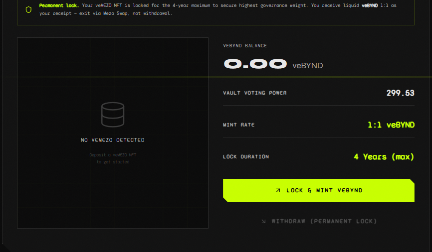
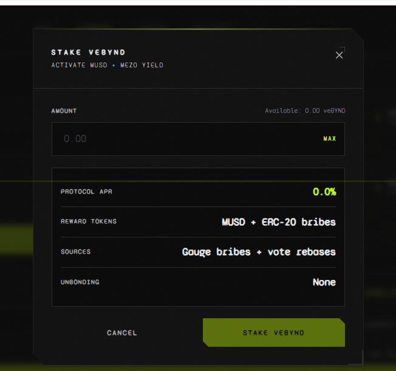
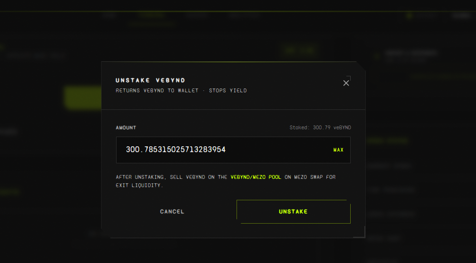

# BynD Protocol

**The Boost Coordination Layer for veMEZO**

*Aggregate. Optimise. Earn. At scale.*

> Mezo Hackathon 2026 — 2nd Place, MEZO Utilization track — Samuel Egin · Gabriel Michael Ojomakpene

---

## Overview

BynD is a non-custodial boost coordination layer that aggregates veMEZO boost liquidity, automates gauge allocation toward the highest-yielding veBTC gauges, and issues **veBYND** — a liquid ERC-20 token representing a transferable claim on the pooled position.

Users deposit veMEZO NFTs into BynD once. The protocol maintains those positions at maximum lock, continuously routes aggregated boost power to the highest-ROI gauges, and compounds veMEZO rebases back into each position automatically. In return, users receive veBYND — freely tradeable or stakeable to earn protocol yield in any ERC-20 token harvested from gauge bribe incentives.

**BynD converts illiquid, inactive veMEZO positions into a liquid, yield-bearing asset.**

> **How veMEZO works on Mezo:** veMEZO is a boost coordination layer — not direct governance. veMEZO holders vote on boost gauges, which amplify veBTC positions by up to 5x. veBTC is the core governance/voting asset. BynD aggregates fragmented veMEZO boost power into a single optimised block, routing it toward the gauges with the highest bribe incentives.

---

## Repository Structure

The repo is a **pnpm workspace monorepo** orchestrated with **Turborepo**:

```
BYND/
├── apps/
│   └── web/                Vite + React frontend (@bynd/web) with Mezo Passport wallet integration
├── packages/
│   └── contracts/          Solidity contracts + Hardhat (bynd-v2-contracts) — deploy scripts, tests, mocks
├── package.json            Root workspace (private) — turbo task entry points
├── pnpm-workspace.yaml     packages: ["apps/*", "packages/*"]
└── turbo.json              Build pipeline & task dependencies
```

All dependencies are installed once from the repo root with `pnpm install` — pnpm hoists every package into a single content-addressed store under the root `node_modules/.pnpm`, and each workspace only receives symlinks to its declared dependencies. Common tasks run from the root via Turborepo (`pnpm build`, `pnpm test`, `pnpm compile`), or against a single workspace with `pnpm --filter @bynd/web <script>` / `pnpm --filter bynd-v2-contracts <script>`.

The frontend targets Mezo Matsnet (Chain ID `31611`) and integrates with the real veMEZO, MUSD, RewardsDistributor, and ValidatorsVoter contracts live on Matsnet, with Mezo Passport for native wallet support across MetaMask, OKX, Unisat, and Xverse. The contracts package also ships mocks (`MockVeMEZO`, `MockERC20`, `MockValidatorsVoter`, `MockRewardsDistributor`) for a Matsnet dry-run against `chainId 31337`.

---

## The Problem

veMEZO holders can direct boost power on Mezo, but participation is structurally low:

- **Manual vote management** — holders must vote every epoch or lose all incentives
- **No liquidity** — veMEZO is a non-transferable NFT with no exit before expiry
- **Fragmented boost power** — individual holders are too small to move gauge outcomes
- **Missed rebases** — Mezo pays a rebase to veMEZO holders each epoch; most go unclaimed
- **Low participation** — boost is misallocated, yield is missed every epoch

---

## The Solution

BynD aggregates veMEZO positions into a single coordinated boost block and automates all epoch actions via permissionless, gas-bounded keeper calls.

### User Flow

```
01  Deposit veMEZO NFT into ByNdVault
02  Receive veBYND (ERC-20) 1:1 with the NFT's locked MEZO amount
03  Stake veBYND to earn rewards (any ERC-20 bribe token)
04  Claim rewards anytime, or exit by selling veBYND on the secondary market
```

---

## Screenshots

### Lock veMEZO & Mint veBYND
Deposit a veMEZO NFT to receive veBYND 1:1. The vault keeps deposited locks extended toward the 4-year maximum for highest governance weight.



### Stake veBYND
Stake veBYND to activate your share of MUSD + ERC-20 bribe yield. No unbonding period.



### Unstake veBYND
Unstake anytime. Exit liquidity via the veBYND/MEZO pool on Mezo Swap.



---

## Architecture

| Contract | Role |
|---|---|
| `ByNdVault` | Custodies veMEZO NFTs (UUPS upgradeable) · mints veBYND 1:1 · every deposit after the first is merged into a single canonical veMEZO NFT via `merge()`, so `extendLocks()`/`claimRebases()` take no arguments and gas never scales with vault size |
| `VeBYND` | Liquid ERC-20 receipt token, `AccessControl`-gated `mint`/`burn` (`MINTER_ROLE`/`BURNER_ROLE`), UUPS upgradeable via `UPGRADER_ROLE` |
| `ByNdStaking` | Multi-token reward distributor (Synthetix `rewardPerToken` pattern, unlimited simultaneous reward tokens) · `claimAll()` / `claimReward(token)` |
| `ByNdVoter` | Epoch state machine · on-chain gauge optimiser or governance-set gauge list · batched bribe claiming · 5-way keeper bounty split · optional protocol fee · emergency epoch escape hatch |

---

## Reward Model

### Stream 1 — veMEZO Rebase (auto-compounds into boost power)

Mezo's RewardsDistributor pays a rebase to veMEZO holders each epoch. A keeper calls `ByNdVault.claimRebases()` — no arguments needed — which triggers `distributor.claimMany(tokenIds)` against whatever the vault currently manages (almost always just the single canonical veMEZO NFT every deposit gets merged into). The distributor calls `ve.depositFor(tokenId, amount)`, compounding the rebase directly back into BynD's locked MEZO balance.

**No liquid tokens leave the vault.** Stakers benefit indirectly: more locked MEZO → larger aggregated boost block → larger share of gauge bribe incentives each epoch.

### Stream 2 — Gauge Bribe Incentives (any ERC-20)

`harvestAndDistribute()` finalizes the epoch's bribe sweep once every managed tokenId has had its bribes claimed via `claimBribesBatch()`. For each harvested token that clears its minimum-harvest threshold:

1. An optional **protocol fee** (`protocolFeeBps`, governance-set, capped at 20%) is sent to `treasury`.
2. A **keeper bounty** (`bountyBps`, governance-set, capped at 5%) is split five ways across the epoch's four keeper roles (whoever called `claimRebases`, `extendLocks`, `optimiseAndVote`, and `harvestAndDistribute` — falling back to `treasury` for any role nobody filled) plus `treasury` itself, so every function that moved the epoch forward gets paid.
3. The remainder is pushed into `ByNdStaking.notifyRewardAmount(token, amount)` for veBYND stakers.

```
stakerShare(i, token) = (stakedBalance(i) / totalStaked) × (harvested × (1 − protocolFeeBps) × (1 − bountyBps))
```

A token that hasn't cleared its harvest threshold (global `minHarvestThreshold`, or a per-token override via `setTokenMinHarvestThreshold`) is simply left in the contract and rolls into next epoch's snapshot instead of forcing a dust payout.

---

## Epoch Execution — 5 Permissionless, Gas-Bounded Steps

None of these are time-gated — every step is callable at any time; the only ordering constraint is on-chain state (you can't vote twice in an epoch, and you can't harvest before claiming). This removes the fixed "vote window" from BynD v1 in favor of a purely state-driven epoch machine.

```
Step 1  claimRebases()             Compounds the veMEZO rebase into whatever the vault currently manages
                                    No epoch gate, no arguments — call any time

Step 2  extendLocks()              Extends the vault's managed lock(s) toward the 4-year maximum
                                    No arguments — harmless no-op for any tokenId that doesn't need it

Step 3  optimiseAndVote()          Routes all managed veMEZO to either governance-set gauges, or the
                                    single highest-claimable alive gauge if none are set
                                    Once per epoch — locks in until harvestAndDistribute() advances the epoch

Step 4  claimBribesBatch(limit)    Pages through managed tokenIds (≤200/call) claiming bribes from all
                                    configured gauges — call repeatedly until claimProgress().readyToHarvest

Step 5  harvestAndDistribute()     Finalizes the epoch: protocol fee → 5-way keeper bounty → staker rewards
                                    Requires claimBribesBatch() to have covered every managed tokenId
```

Any wallet can call any step. The four keeper roles (rebases / locks / vote / harvest) are each paid independently at harvest time, so there's no incentive to withhold a step waiting for someone else to do the rest.

**Governance escape hatch:** if a misconfigured (too-high) harvest threshold would otherwise stall the protocol forever — bribes for an epoch can only be claimed once — `forceCloseEpoch()` lets governance close out the epoch without any token clearing its threshold. Already-claimed balances stay in the contract and roll into the next epoch's snapshot.

---

## Live Deployment — Mezo Matsnet (chainId 31611)

| Contract | Address |
|---|---|
| veMEZO (native) | `0xaCE816CA2bcc9b12C59799dcC5A959Fb9b98111b` |
| ValidatorsVoter (native) | `0x21d7bDF5a5929AD179F8cA0c9014A0B62ae6Bfd1` |
| RewardsDistributor (native) | `0x2962E8817ae716019F759d098e2caE658bDcAd04` |
| **VeBYND** | `0x9988bD1a255b2d8CeE01F27DA7f7D8A2630F937E` |
| **ByNdVault** | `0x558969087977FeDb15d7941BB71227948C0497fA` |
| **ByNdStaking** | `0xA224d206347d105C6F59869055496398111b1aaB` |
| **ByNdVoter** | `0x6f47c26d42A22f05A4fc9aCFFBe4249A42d38f7B` |

Addresses are re-generated on every `deploy:matsnet` run and written to `packages/contracts/deployments/<network>-<timestamp>.json` — the table above reflects the latest deployment record in that folder.

---

## Running the Contracts

### Prerequisites
- Node.js v18+
- pnpm v10+ (`corepack enable` or `npm i -g pnpm`)

### Install (repo root)
```bash
pnpm install
```

### Compile & test
```bash
pnpm --filter bynd-v2-contracts compile
pnpm --filter bynd-v2-contracts test
```

The suite currently covers 13 test files / 156 tests: core behavior per contract (`01`–`04`), a full integration epoch (`05`), reentrancy attack mocks (`06`), economic/invariant checks — reward conservation, precision drift, bounty rounding, MEV-sniping documentation (`07`), extra coverage per contract (`08`–`11`), protocol fee accounting (`12`), and the per-token harvest-threshold guard (`13`).

### Deploy / redeploy to Matsnet
Contracts are already live at the addresses above — only redeploy if you need a fresh instance.

```bash
# packages/contracts/.env
DEPLOYER_PRIVATE_KEY=0x...
# optional overrides — see .env.example
MATSNET_RPC_URL=
VEMEZO_ADDRESS=
BOOST_VOTER_ADDRESS=
REWARDS_DISTRIBUTOR_ADDRESS=
TREASURY_ADDRESS=
```

```bash
pnpm install
pnpm --filter bynd-v2-contracts deploy:matsnet
```

The deploy script:
- Deploys all 4 contracts as UUPS proxies
- Wires `MINTER_ROLE` on veBYND, the rewards distributor, and the voter/vault link
- Saves addresses to `packages/contracts/deployments/mezotestnet-<timestamp>.json`

> `deploy-matsnet.js` also accepts `chainId 31337` (a local Hardhat network) as a dry-run target — in that mode it deploys `MockVeMEZO`, `MockERC20`, `MockValidatorsVoter`, and `MockRewardsDistributor` in place of live Mezo infra instead of touching Matsnet.

### Other keeper/ops scripts
```bash
pnpm --filter bynd-v2-contracts scan:gauges    # scan ValidatorsVoter for alive gauges
pnpm --filter bynd-v2-contracts check:gauge    # inspect a single gauge's status
pnpm --filter bynd-v2-contracts run:epoch      # deposit → configure gauge → vote → claim → harvest, end to end
```

### Frontend
```bash
# after any redeploy, update apps/web/.env with the new addresses
pnpm --filter @bynd/web sync-addresses
pnpm --filter @bynd/web dev
```

### Keeper operations (via `cast`, each epoch)
```bash
# Step 1 — any time, no arguments
cast send <ByNdVault> "claimRebases()" --private-key <KEY> --rpc-url <RPC>

# Step 2 — any time, no arguments
cast send <ByNdVault> "extendLocks()" --private-key <KEY> --rpc-url <RPC>

# Step 3 — once per epoch
cast send <ByNdVoter> "optimiseAndVote()" --private-key <KEY> --rpc-url <RPC>

# Step 4 — repeat until claimProgress().readyToHarvest
cast send <ByNdVoter> "claimBribesBatch(uint256)" 200 --private-key <KEY> --rpc-url <RPC>

# Step 5 — earns a keeper bounty share
cast send <ByNdVoter> "harvestAndDistribute()" --private-key <KEY> --rpc-url <RPC>
```

The web app's **Keeper dashboard** (`apps/web/src/pages/Keeper.tsx`) exposes `claimRebases`, `extendLocks`, `optimiseAndVote`, and `harvestAndDistribute` as one-click buttons; `claimBribesBatch` is currently only wired up in `scripts/run-test-epoch.js`, not yet in the UI.

---

## Tech Stack

| Layer | Stack |
|---|---|
| Monorepo | pnpm workspaces · Turborepo |
| Smart Contracts | Solidity 0.8.20 · Hardhat · OpenZeppelin Upgradeable 4.9.x (UUPS) · ethers v6 |
| Frontend | React 18 · Vite · wagmi v2 · viem · React Router |
| Wallet | Mezo Passport · RainbowKit · MetaMask · OKX · Unisat · Xverse |
| Styling | Tailwind CSS · Framer Motion |
| Keeper Scripts | Node.js (Hardhat scripts) · Foundry `cast` |

---

## Team

**Samuel Egin** — Blockchain Dev · [@0xEtherfren](https://x.com/0xEtherfren)

**Gabriel Michael Ojomakpene** — Frontend Dev · [LinkedIn](https://www.linkedin.com/in/codewitgabi)

*Mezo Hackathon 2026 — 2nd place, MEZO Utilization track*
